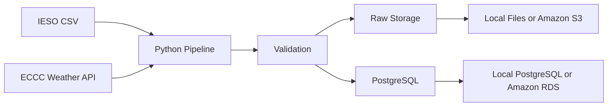

# Ontario Energy Data Warehouse

This project collects Ontario electricity demand and Toronto weather data, checks the data, and loads clean records into PostgreSQL.

It can run in two ways:

- Locally with Docker and local files
- On AWS with S3 and RDS

## What this project solves

Public data is not always ready to use.

Files may contain:

- Missing records
- Duplicate rows
- Invalid values
- Corrected data
- Extra metadata

This pipeline checks these problems before loading the data into the database.

## Data sources

### IESO electricity demand

The IESO CSV contains:

- Date
- Hour
- Market Demand
- Ontario Demand

The file also contains metadata rows before the real table.

### ECCC weather data

Weather data comes from the Environment and Climate Change Canada API.

Station:

```text
Toronto City Centre
Station ID: 48549
```

The pipeline downloads monthly weather data starting from January 1, 2026.

## Simple architecture



## What the pipeline does

1. Downloads electricity and weather data
2. Saves the original raw files
3. Checks the data
4. Finds missing weather hours
5. Prevents duplicate files and rows
6. Inserts new records
7. Updates corrected records
8. Records each pipeline run

## Local mode

Local mode uses:

- Local raw files
- PostgreSQL running in Docker

Flow:

```text
Public data
    -> data/raw
    -> validation
    -> local PostgreSQL
```

Local settings:

```env
RAW_STORAGE_MODE=local
S3_UPLOAD_ENABLED=false
```

## AWS mode

AWS mode uses:

- Amazon S3 for permanent raw-file storage
- Amazon RDS for PostgreSQL
- Temporary local files while the pipeline runs

Flow:

```text
Amazon S3
    -> temporary local folder
    -> validation
    -> Amazon RDS
    -> temporary files deleted
```

AWS settings:

```env
RAW_STORAGE_MODE=s3
S3_UPLOAD_ENABLED=true
```

Amazon S3 is the main raw-data storage in AWS mode.

Temporary files are deleted after a successful pipeline run.

## S3 folder structure

Raw files are stored like this:

```text
raw/ieso/PUB_Demand_<timestamp>_<hash>.csv
raw/eccc/2026/toronto_city_centre_<date_range>_<timestamp>_<hash>.json
```

The hash helps prevent the same file from being stored more than once.

## Data checks

### Electricity checks

The pipeline checks:

- Required columns exist
- Dates are valid
- Hours are between 1 and 24
- Demand values are positive
- Values are not missing
- Date and hour combinations are unique

### Weather checks

The pipeline checks:

- Station information exists
- Timestamps are valid
- Humidity is between 0 and 100
- Wind speed is not negative
- Precipitation is not negative
- Duplicate timestamps are removed
- Records are sorted by time

Missing weather-hour rules:

```text
0 missing hours: pass
1 to 5 missing hours: warning
More than 5 missing hours: fail
```

## Incremental loading

The pipeline does not reload everything blindly.

```text
New record: insert
Same record: skip
Corrected record: update
```

## Database tables

### `energy_demand_hourly`

Stores hourly Ontario electricity demand.

### `weather_hourly`

Stores hourly Toronto weather data.

### `ingestion_runs`

Stores information about each pipeline run, including:

- Status
- Start and finish time
- Source file
- Row counts
- Errors

## Main tools

- Python
- Pandas
- PostgreSQL
- Docker
- pytest
- Amazon S3
- Amazon RDS
- Boto3
- AWS CLI

## Local setup

Create the virtual environment:

```powershell
python -m venv .venv
.venv\Scripts\Activate.ps1
```

Install packages:

```powershell
python -m pip install -r requirements.txt
```

Start PostgreSQL and create the tables:

```powershell
powershell -ExecutionPolicy Bypass -File scripts/start_local.ps1
```

Run the local pipeline:

```powershell
Remove-Item Env:ENV_FILE -ErrorAction SilentlyContinue

$env:PYTHONPATH="src"

python -m ontario_energy_warehouse.run_pipeline
```

## Run on AWS

Use the AWS environment file:

```powershell
$env:ENV_FILE=".env.aws"
$env:PYTHONPATH="src"
```

Create the tables in RDS:

```powershell
python scripts/apply_schema.py
```

Run the pipeline:

```powershell
python -m ontario_energy_warehouse.run_pipeline
```

In AWS mode, the pipeline:

1. Downloads existing raw files from S3
2. Checks for new source data
3. Uploads new raw files to S3
4. Validates the data
5. Loads clean records into RDS
6. Deletes temporary local files

## Run tests

Local PostgreSQL must be running.

```powershell
Remove-Item Env:ENV_FILE -ErrorAction SilentlyContinue

$env:PYTHONPATH="src"

pytest
```

AWS calls are mocked during tests. Tests do not upload files to the real S3 bucket.

## Security

- AWS credentials are not stored in the code
- `.env` and `.env.aws` are ignored by Git
- The S3 bucket is private
- S3 versioning is enabled
- RDS uses SSL
- RDS access is limited to an approved IP address
- The AWS root account is not used for normal work

## Stop local PostgreSQL

```powershell
docker compose stop
```

This stops PostgreSQL without deleting the database data.

## Current limitations

- The pipeline is started manually
- AWS mode downloads raw files into a temporary folder
- Only one weather station is used
- Scheduling and advanced monitoring will be added in the next project