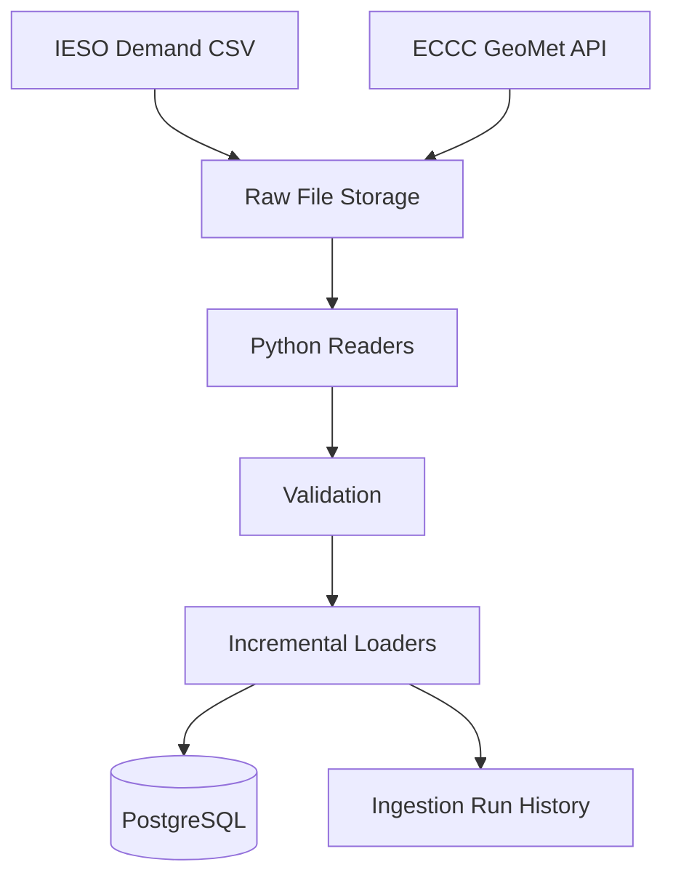

# Ontario Energy Data Warehouse

This project collects Ontario electricity demand and Toronto weather data, checks the data, and loads clean records into PostgreSQL.

## Problem

Energy analysis requires dependable electricity and weather data. Public source files may contain metadata rows, missing observations, duplicate downloads, corrected records, and inconsistent null values.

This project creates one trusted local warehouse while preserving the original source data for auditing and recovery.


## Data sources

IESO hourly demand CSV

Environment and Climate Change Canada hourly weather API

Weather station: Toronto City Centre

Station ID: 48549

## Architecture



## What the pipeline does

1. Downloads electricity and weather data
2. Saves the original raw files
3. Checks required columns and values
4. Finds missing weather hours
5. Prevents duplicate files and rows
6. Inserts new records
7. Updates corrected records
8. Records each pipeline run

## Main tools

Python

Pandas

PostgreSQL

Docker

pytest

## Database tables

`energy_demand_hourly`

Stores hourly Ontario electricity demand.

`weather_hourly`

Stores hourly Toronto weather observations.

`ingestion_runs`

Stores pipeline status, row counts, files, and errors.

## Local setup

Create and activate the environment:

```powershell
python -m venv .venv
.venv\Scripts\Activate.ps1
```

Install packages:

```powershell
python -m pip install -r requirements.txt
```

Start PostgreSQL and create the tables:

```powershell
powershell -ExecutionPolicy Bypass -File scripts/start_local.ps1
```

## Run the pipeline

```powershell
$env:PYTHONPATH="src"
python -m ontario_energy_warehouse.run_pipeline
```

## Run tests

PostgreSQL must be running.

```powershell
pytest -q
```

## Stop PostgreSQL

```powershell
docker compose stop
```

This stops the database without deleting the stored data.